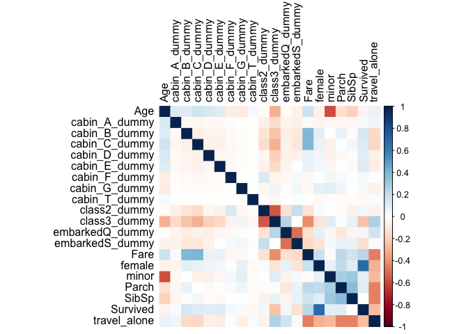
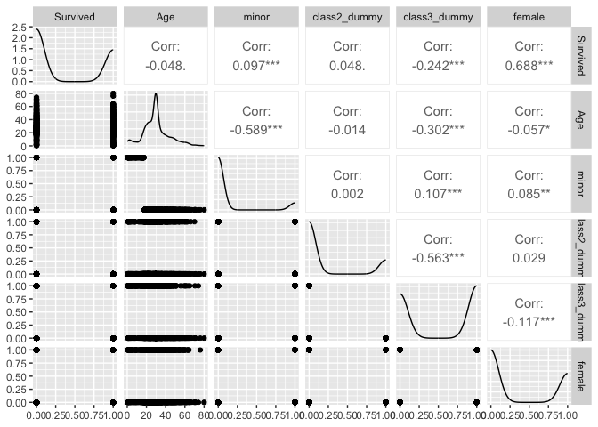
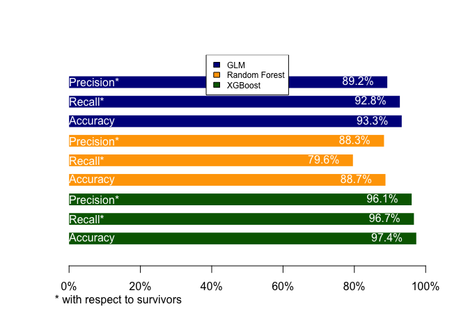

kaggle_titanic
================
2024-10-28

## R Markdown

This is an R Markdown document.

``` r
rm(list = ls())

library(randomForest)
```

    ## randomForest 4.7-1.1

    ## Type rfNews() to see new features/changes/bug fixes.

``` r
library(xgboost)
```

    ## Warning: package 'xgboost' was built under R version 4.3.3

``` r
library(neuralnet)
library(keras)
library(tensorflow)
library(corrplot)
```

    ## Warning: package 'corrplot' was built under R version 4.3.3

    ## corrplot 0.95 loaded

``` r
library("GGally")
```

    ## Loading required package: ggplot2

    ## 
    ## Attaching package: 'ggplot2'

    ## The following object is masked from 'package:randomForest':
    ## 
    ##     margin

    ## Registered S3 method overwritten by 'GGally':
    ##   method from   
    ##   +.gg   ggplot2

``` r
setwd(dirname(rstudioapi::getActiveDocumentContext()$path))

df_train <- read.csv("train.csv")
df_test <- read.csv("test.csv")
df_gs <- read.csv("gender_submission.csv")

all(names(df_test) %in% names(df_train) )
```

    ## [1] TRUE

``` r
# add labels to test set
df_test <- merge(df_test, df_gs, all.x = T, by = "PassengerId")
rm(df_gs)

summary(df_train)
```

    ##   PassengerId       Survived          Pclass          Name          
    ##  Min.   :  1.0   Min.   :0.0000   Min.   :1.000   Length:891        
    ##  1st Qu.:223.5   1st Qu.:0.0000   1st Qu.:2.000   Class :character  
    ##  Median :446.0   Median :0.0000   Median :3.000   Mode  :character  
    ##  Mean   :446.0   Mean   :0.3838   Mean   :2.309                     
    ##  3rd Qu.:668.5   3rd Qu.:1.0000   3rd Qu.:3.000                     
    ##  Max.   :891.0   Max.   :1.0000   Max.   :3.000                     
    ##                                                                     
    ##      Sex                 Age            SibSp           Parch       
    ##  Length:891         Min.   : 0.42   Min.   :0.000   Min.   :0.0000  
    ##  Class :character   1st Qu.:20.12   1st Qu.:0.000   1st Qu.:0.0000  
    ##  Mode  :character   Median :28.00   Median :0.000   Median :0.0000  
    ##                     Mean   :29.70   Mean   :0.523   Mean   :0.3816  
    ##                     3rd Qu.:38.00   3rd Qu.:1.000   3rd Qu.:0.0000  
    ##                     Max.   :80.00   Max.   :8.000   Max.   :6.0000  
    ##                     NA's   :177                                     
    ##     Ticket               Fare           Cabin             Embarked        
    ##  Length:891         Min.   :  0.00   Length:891         Length:891        
    ##  Class :character   1st Qu.:  7.91   Class :character   Class :character  
    ##  Mode  :character   Median : 14.45   Mode  :character   Mode  :character  
    ##                     Mean   : 32.20                                        
    ##                     3rd Qu.: 31.00                                        
    ##                     Max.   :512.33                                        
    ## 

``` r
apply(is.na(df_train), 2,sum)
```

    ## PassengerId    Survived      Pclass        Name         Sex         Age 
    ##           0           0           0           0           0         177 
    ##       SibSp       Parch      Ticket        Fare       Cabin    Embarked 
    ##           0           0           0           0           0           0

``` r
# join train and test set such that data needs to be prepared only once 
df_train$train_test_split <- "train"
df_test$train_test_split <- "test"
df <- rbind(df_train, df_test)
rm(df_train, df_test)

df$female <- 0
df$female[df$Sex == 'female'] <- 1

df$class2_dummy <- df$class3_dummy <- 0 # reference class 1
df$class2_dummy[df$Pclass == 2] <- 1
df$class3_dummy[df$Pclass == 3] <- 1

df$Embarked[df$Embarked == ""] <- median(df$Embarked) # impute ####
df$embarkedQ_dummy <- df$embarkedS_dummy <- 0 # reference cat C
df$embarkedQ_dummy[df$Embarked == "Q"] <- 1
df$embarkedS_dummy[df$Embarked == "S"] <- 1

# strsplit(df_train$Cabin, "[A-Z]")

df$cabin_info <- I(df$Cabin != "") * 1
df$cabin_letter <- substr(df$Cabin,1,1)
df$cabin_A_dummy <- df$cabin_B_dummy <- df$cabin_C_dummy <- df$cabin_D_dummy <- df$cabin_E_dummy <- df$cabin_F_dummy <- df$cabin_G_dummy <- df$cabin_T_dummy <- 0 # reference cat ""
df$cabin_A_dummy[df$cabin_letter == 'A'] <- 1
df$cabin_B_dummy[df$cabin_letter == 'B'] <- 1
df$cabin_C_dummy[df$cabin_letter == 'C'] <- 1
df$cabin_D_dummy[df$cabin_letter == 'D'] <- 1
df$cabin_E_dummy[df$cabin_letter == 'E'] <- 1
df$cabin_F_dummy[df$cabin_letter == 'F'] <- 1
df$cabin_G_dummy[df$cabin_letter == 'G'] <- 1
df$cabin_T_dummy[df$cabin_letter == 'T'] <- 1

# shared cabin 


# impute
plot(df$Age, df$Survived, pch = 16, col = rgb(0, 0, 0, 0.05))
```

<!-- -->

``` r
with(df[!is.na(df$Age),], table(Survived))
```

    ## Survived
    ##   0   1 
    ## 629 417

``` r
df$Age[is.na(df$Age)] <- mean(df$Age, na.rm = T)
df$minor <- 0
df$minor[df$Age < 18] <- 1


# adult travelling with minor 


# travel alone 
df$travel_alone <- 0
tmp <- data.frame(table(df$Ticket))
names(tmp) <- c("Ticket", "travelers with ticket")
df <- merge(df, tmp, all.x = T, by = "Ticket")
rm(tmp)
df$travel_alone[df$`travelers with ticket` == 1] <- 1
```

<!-- -->

More detail:

<!-- -->

``` r
df_train <- dff[dff$train_test_split == 'train',]
set.seed(123)
random_sample <- sample(1:nrow(df_train), round(.8*nrow(df_train)), replace = F)
df_val <- df_train[-random_sample,]
df_train <- df_train[random_sample,]
df_test <- dff[dff$train_test_split == 'test',]

df_train$train_test_split <- df_val$train_test_split <- df_test$train_test_split <- NULL
rm(df, dff)
```

``` r
# model ####
m1 <- glm(Survived ~ 
          .
          , data = df_train
          , family = "binomial")

pred_probs <- predict(m1, newdata = df_train, type = "response")

m2_rf <- randomForest(as.factor(Survived) ~ 
                     .
                   , data = df_train
                   , proximity=T
                   , ntree = 10000
                   , nodesize = 10
                   , corr.bias = T) 

var_order <- c(
   'Age'
  ,'minor'
  ,'class2_dummy'
  ,'class3_dummy'
  ,'female'
  ,'Fare'
  ,'SibSp'
  ,'Parch'
  ,'embarkedQ_dummy'
  ,'embarkedS_dummy'
  ,'cabin_A_dummy'
  ,'cabin_B_dummy'
  ,'cabin_C_dummy'
  ,'cabin_D_dummy'
  ,'cabin_E_dummy'
  ,'cabin_F_dummy'
  ,'cabin_G_dummy'
  ,'cabin_T_dummy'
  ,'travel_alone'  
  ,'Survived'
)

df_train_mat <- subset(df_train, select = var_order)
df_val_mat <- subset(df_val, select = var_order)
df_test_mat <- subset(df_test, select = var_order)

df_train_mat <- as.matrix(df_train_mat)
df_val_mat <- as.matrix(df_val_mat)
df_test_mat <- as.matrix(df_test_mat)

params <- list(
  objective = "binary:logistic"  # Objective function here
  ,eval_metric = "auc"           # Evaluation metric
  ,max_depth = 5                 # default 6
  #,subsample = .5                # default 1
  ,gamma = 6                     # minimum loss reduction required to make a further partition on leaf node
)

# Prepare data using xgb.DMatrix
dtrain <- xgb.DMatrix(data = df_train_mat[, 1:(ncol(df_train_mat)-1)], label = df_train_mat[, ncol(df_train_mat)])
dval <- xgb.DMatrix(data = df_val_mat[, 1:(ncol(df_val_mat)-1)], label = df_val_mat[, ncol(df_val_mat)])

# Construct the watchlist
watchlist <- list(train = dtrain, val = dval)

# Train the model using xgb.train
m3_xgb <- xgb.train(params = params,                         # Model parameters
          data = dtrain,                                     # Training data (DMatrix)
          watchlist = watchlist,                             # Watchlist with train and validation sets
          nrounds = 50000,                                   # Max number of boosting iterations
          early_stopping_rounds = 100,                        # Stop if no improvement after 10 rounds
          verbose = 1)                                       # Print progress
```

    ## [1]  train-auc:0.864823  val-auc:0.863981 
    ## Multiple eval metrics are present. Will use val_auc for early stopping.
    ## Will train until val_auc hasn't improved in 100 rounds.
    ## 
    ## [2]  train-auc:0.864823  val-auc:0.863981 
    ## [3]  train-auc:0.869872  val-auc:0.863648 
    ## [4]  train-auc:0.868656  val-auc:0.860457 
    ## [5]  train-auc:0.880682  val-auc:0.856203 
    ## [6]  train-auc:0.880682  val-auc:0.856203 
    ## [7]  train-auc:0.884953  val-auc:0.866241 
    ## [8]  train-auc:0.885619  val-auc:0.863316 
    ## [9]  train-auc:0.885619  val-auc:0.863316 
    ## [10] train-auc:0.885619  val-auc:0.863316 
    ## [11] train-auc:0.885619  val-auc:0.863316 
    ## [12] train-auc:0.885619  val-auc:0.863316 
    ## [13] train-auc:0.885619  val-auc:0.863316 
    ## [14] train-auc:0.885619  val-auc:0.863316 
    ## [15] train-auc:0.885619  val-auc:0.863316 
    ## [16] train-auc:0.885619  val-auc:0.863316 
    ## [17] train-auc:0.885619  val-auc:0.863316 
    ## [18] train-auc:0.885619  val-auc:0.863316 
    ## [19] train-auc:0.885619  val-auc:0.863316 
    ## [20] train-auc:0.885619  val-auc:0.863316 
    ## [21] train-auc:0.885619  val-auc:0.863316 
    ## [22] train-auc:0.885619  val-auc:0.863316 
    ## [23] train-auc:0.885619  val-auc:0.863316 
    ## [24] train-auc:0.885619  val-auc:0.863316 
    ## [25] train-auc:0.885619  val-auc:0.863316 
    ## [26] train-auc:0.885619  val-auc:0.863316 
    ## [27] train-auc:0.885619  val-auc:0.863316 
    ## [28] train-auc:0.885619  val-auc:0.863316 
    ## [29] train-auc:0.885619  val-auc:0.863316 
    ## [30] train-auc:0.885619  val-auc:0.863316 
    ## [31] train-auc:0.885619  val-auc:0.863316 
    ## [32] train-auc:0.885619  val-auc:0.863316 
    ## [33] train-auc:0.885619  val-auc:0.863316 
    ## [34] train-auc:0.885619  val-auc:0.863316 
    ## [35] train-auc:0.885619  val-auc:0.863316 
    ## [36] train-auc:0.885619  val-auc:0.863316 
    ## [37] train-auc:0.885619  val-auc:0.863316 
    ## [38] train-auc:0.885619  val-auc:0.863316 
    ## [39] train-auc:0.885619  val-auc:0.863316 
    ## [40] train-auc:0.885619  val-auc:0.863316 
    ## [41] train-auc:0.885619  val-auc:0.863316 
    ## [42] train-auc:0.885619  val-auc:0.863316 
    ## [43] train-auc:0.885619  val-auc:0.863316 
    ## [44] train-auc:0.885619  val-auc:0.863316 
    ## [45] train-auc:0.885619  val-auc:0.863316 
    ## [46] train-auc:0.885619  val-auc:0.863316 
    ## [47] train-auc:0.885619  val-auc:0.863316 
    ## [48] train-auc:0.885619  val-auc:0.863316 
    ## [49] train-auc:0.885619  val-auc:0.863316 
    ## [50] train-auc:0.885619  val-auc:0.863316 
    ## [51] train-auc:0.885619  val-auc:0.863316 
    ## [52] train-auc:0.885619  val-auc:0.863316 
    ## [53] train-auc:0.885619  val-auc:0.863316 
    ## [54] train-auc:0.885619  val-auc:0.863316 
    ## [55] train-auc:0.885619  val-auc:0.863316 
    ## [56] train-auc:0.885619  val-auc:0.863316 
    ## [57] train-auc:0.885619  val-auc:0.863316 
    ## [58] train-auc:0.885619  val-auc:0.863316 
    ## [59] train-auc:0.885619  val-auc:0.863316 
    ## [60] train-auc:0.885619  val-auc:0.863316 
    ## [61] train-auc:0.885619  val-auc:0.863316 
    ## [62] train-auc:0.885619  val-auc:0.863316 
    ## [63] train-auc:0.885619  val-auc:0.863316 
    ## [64] train-auc:0.885619  val-auc:0.863316 
    ## [65] train-auc:0.885619  val-auc:0.863316 
    ## [66] train-auc:0.885619  val-auc:0.863316 
    ## [67] train-auc:0.885619  val-auc:0.863316 
    ## [68] train-auc:0.885619  val-auc:0.863316 
    ## [69] train-auc:0.885619  val-auc:0.863316 
    ## [70] train-auc:0.885619  val-auc:0.863316 
    ## [71] train-auc:0.885619  val-auc:0.863316 
    ## [72] train-auc:0.885619  val-auc:0.863316 
    ## [73] train-auc:0.885619  val-auc:0.863316 
    ## [74] train-auc:0.885619  val-auc:0.863316 
    ## [75] train-auc:0.885619  val-auc:0.863316 
    ## [76] train-auc:0.885619  val-auc:0.863316 
    ## [77] train-auc:0.885619  val-auc:0.863316 
    ## [78] train-auc:0.885619  val-auc:0.863316 
    ## [79] train-auc:0.885619  val-auc:0.863316 
    ## [80] train-auc:0.885619  val-auc:0.863316 
    ## [81] train-auc:0.885619  val-auc:0.863316 
    ## [82] train-auc:0.885619  val-auc:0.863316 
    ## [83] train-auc:0.885619  val-auc:0.863316 
    ## [84] train-auc:0.885619  val-auc:0.863316 
    ## [85] train-auc:0.885619  val-auc:0.863316 
    ## [86] train-auc:0.885619  val-auc:0.863316 
    ## [87] train-auc:0.885619  val-auc:0.863316 
    ## [88] train-auc:0.885619  val-auc:0.863316 
    ## [89] train-auc:0.885619  val-auc:0.863316 
    ## [90] train-auc:0.885619  val-auc:0.863316 
    ## [91] train-auc:0.885619  val-auc:0.863316 
    ## [92] train-auc:0.885619  val-auc:0.863316 
    ## [93] train-auc:0.885619  val-auc:0.863316 
    ## [94] train-auc:0.885619  val-auc:0.863316 
    ## [95] train-auc:0.885619  val-auc:0.863316 
    ## [96] train-auc:0.885619  val-auc:0.863316 
    ## [97] train-auc:0.885619  val-auc:0.863316 
    ## [98] train-auc:0.885619  val-auc:0.863316 
    ## [99] train-auc:0.885619  val-auc:0.863316 
    ## [100]    train-auc:0.885619  val-auc:0.863316 
    ## [101]    train-auc:0.885619  val-auc:0.863316 
    ## [102]    train-auc:0.885619  val-auc:0.863316 
    ## [103]    train-auc:0.885619  val-auc:0.863316 
    ## [104]    train-auc:0.885619  val-auc:0.863316 
    ## [105]    train-auc:0.885619  val-auc:0.863316 
    ## [106]    train-auc:0.885619  val-auc:0.863316 
    ## [107]    train-auc:0.885619  val-auc:0.863316 
    ## Stopping. Best iteration:
    ## [7]  train-auc:0.884953  val-auc:0.866241

``` r
# Prepare test data using xgb.DMatrix
dtest <- xgb.DMatrix(data = df_test_mat[, 1:(ncol(df_test_mat)-1)])  # Exclude the label column

# Make predictions on the test set
predictions <- predict(m3_xgb, dtest)
```

``` r
df_test$pred_probs <- predict(m1, newdata = df_test, type = "response")
df_test$pred_class <- NA
df_test$pred_class[df_test$pred_probs <= .5] <- 0
df_test$pred_class[df_test$pred_probs > .5] <- 1

df_test$pred_class_rf <- predict(m2_rf, df_test)


pred_probs_xgb <- predict(m3_xgb, newdata = df_test_mat[,1:(ncol(df_test_mat)-1)])
pred_class_xgb <- NA
pred_class_xgb[pred_probs_xgb <= .5] <- 0
pred_class_xgb[pred_probs_xgb > .5] <- 1


conf_mat_glm <- table("ground truth"=df_test$Survived, "pred"=df_test$pred_class)
conf_mat_rf <- table("ground truth"=df_test$Survived, "pred"=df_test$pred_class_rf)
conf_mat_xgb <- table("ground truth"=df_test$Survived,"pred"=pred_class_xgb)


plot(1,1,type = "n", xlim = c(0,1), ylim = c(10,0), axes = F, xlab = "", ylab = "")
axis(1, at = seq(0,1,.2), labels = c("0%","20%","40%","60%","80%","100%"))
rect(0,1-.3, conf_mat_glm[2,2] / sum(conf_mat_glm[,2]), 1+.3, col = "darkblue", lwd = 0)
rect(0,2-.3, conf_mat_glm[2,2] / sum(conf_mat_glm[2,]), 2+.3, col = "darkblue", lwd = 0)
rect(0,3-.3, sum(diag(conf_mat_glm)) / sum(conf_mat_glm), 3+.3, col = "darkblue", lwd = 0)

rect(0,4-.3, conf_mat_rf[2,2] / sum(conf_mat_rf[,2]), 4+.3, col = "orange", lwd = 0)
rect(0,5-.3, conf_mat_rf[2,2] / sum(conf_mat_rf[2,]), 5+.3, col = "orange", lwd = 0)
rect(0,6-.3, sum(diag(conf_mat_rf)) / sum(conf_mat_rf), 6+.3, col = "orange", lwd = 0)

rect(0,7-.3, conf_mat_xgb[2,2] / sum(conf_mat_xgb[,2]), 7+.3, col = "darkgreen", lwd = 0)
rect(0,8-.3, conf_mat_xgb[2,2] / sum(conf_mat_xgb[2,]), 8+.3, col = "darkgreen", lwd = 0)
rect(0,9-.3, sum(diag(conf_mat_xgb)) / sum(conf_mat_xgb), 9+.3, col = "darkgreen", lwd = 0)

text(0,c(1,4,7), "Precision*",  col = "white", adj = 0)
text(0,c(2,5,8), "Recall*",  col = "white", adj = 0)
text(0,c(3,6,9), "Accuracy",  col = "white", adj = 0)

text(conf_mat_glm[2,2] / sum(conf_mat_glm[,2]), 1, labels = paste0(round(conf_mat_glm[2,2] / sum(conf_mat_glm[,2]) * 100, 1), "%"), adj = 1, pos = 2, offset = 1, col = "white")
text(conf_mat_glm[2,2] / sum(conf_mat_glm[2,]), 2, labels = paste0(round(conf_mat_glm[2,2] / sum(conf_mat_glm[2,]) * 100, 1), "%"), adj = 1, pos = 2, offset = 1, col = "white")
text(sum(diag(conf_mat_glm)) / sum(conf_mat_glm), 3, labels = paste0(round(sum(diag(conf_mat_glm)) / sum(conf_mat_glm) * 100, 1), "%"), adj = 1, pos = 2, offset = 1, col = "white")
text(conf_mat_rf[2,2] / sum(conf_mat_rf[,2]), 4, labels = paste0(round(conf_mat_rf[2,2] / sum(conf_mat_rf[,2]) * 100, 1), "%"), adj = 1, pos = 2, offset = 1, col = "white")
text(conf_mat_rf[2,2] / sum(conf_mat_rf[2,]), 5, labels = paste0(round(conf_mat_rf[2,2] / sum(conf_mat_rf[2,]) * 100, 1), "%"), adj = 1, pos = 2, offset = 1, col = "white")
text(sum(diag(conf_mat_rf)) / sum(conf_mat_rf), 6, labels = paste0(round(sum(diag(conf_mat_rf)) / sum(conf_mat_rf) * 100, 1), "%"), adj = 1, pos = 2, offset = 1, col = "white")
text(conf_mat_xgb[2,2] / sum(conf_mat_xgb[,2]), 7, labels = paste0(round(conf_mat_xgb[2,2] / sum(conf_mat_xgb[,2]) * 100, 1), "%"), adj = 1, pos = 2, offset = 1, col = "white")
text(conf_mat_xgb[2,2] / sum(conf_mat_xgb[2,]), 8, labels = paste0(round(conf_mat_xgb[2,2] / sum(conf_mat_xgb[2,]) * 100, 1), "%"), adj = 1, pos = 2, offset = 1, col = "white")
text(sum(diag(conf_mat_xgb)) / sum(conf_mat_xgb), 9, labels = paste0(round(sum(diag(conf_mat_xgb)) / sum(conf_mat_xgb) * 100, 1), "%"), adj = 1, pos = 2, offset = 1, col = "white")

legend("top", horiz = F, legend = c("GLM","Random Forest","XGBoost"), fill = c("darkblue","orange","darkgreen"), cex = .75)

mtext("* with respect to survivors", side = 1, line = 2, adj = 0)
```

<!-- -->

``` r
plot(1,1, type = "n", xlim = c(0,150), ylim = c(0, length(m2_rf$importance)+1), axes = F, xlab = "", ylab = "")
rect(0, 
     length(m2_rf$importance):1-.4, 
     m2_rf$importance[rev(order(m2_rf$importance))], 
     length(m2_rf$importance):1+.4,
     col = "black"
     #,density = .5
     , border = F
     )
text(m2_rf$importance[rev(order(m2_rf$importance))] + 10, 
     length(m2_rf$importance):1, 
     names(m2_rf$forest$xlevels)[rev(order(m2_rf$importance))], adj = 0) 
axis(1)
mtext("Feature Importance", side = 1, line = 3)
```

<!-- -->
